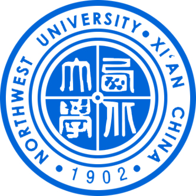

# Griffin

A Nintendo Character

- - -

### about

西北大学（Northwest University），简称“西大”，始建于1902年，由清末光绪皇帝御笔朱批设立，坐落于古都西安，是中华人民共和国教育部与陕西省人民政府共建的综合性全国重点大学，位列国家“211工程”、首批国家“双一流”世界一流学科建设高校，入选“111计划”、“国家大学生创新性实验计划”、“国家建设高水平大学公派研究生项目”，是中西部高校基础能力建设工程大学、中日人文交流大学联盟高校，是国家“一省一校”计划重点建设院校、新丝绸之路大学联盟、长安联盟成员高校之一，是国家首批具有博士、硕士学位授予权的单位，是中国西北地区历史最为悠久的高等学府。
西北大学肇始于1902年的陕西大学堂和京师大学堂速成科仕学馆。1912年始称西北大学。1923年改为国立西北大学。1937年西迁来陕的国立北平大学、北平师范大学、北洋工学院和国立北平研究院等组成国立西安临时大学，1938年改为国立西北联合大学，1939年复称国立西北大学。新中国成立后为教育部直属综合性大学。1950年复名西北大学。1958年改隶陕西省主管。1978年被确定为全国重点大学。
在长期的发展历程中，西北大学形成了“发扬民族精神，融合世界思想，肩负建设西北之重任”的办学理念，被誉为“中华石油英才之母”“经济学家的摇篮”“作家摇篮”。
截至2018年3月，学校太白、桃园、长安三个校区总占地面积2360余亩；全日制在校生25000余人，其中全日制本科生13000余人，研究生7500余人，留学生1000余人 。

### Links

 * [1915—1923年]
     * [从1915年到1923年底，其四任校长中：第一任校长周镛（石生）为原陕西高等学堂监督；第三任校长郗朝俊为原西北大学创设会委员、农科学长，原高等学堂留日法学学士，1946年8月起复任西北大学法律系教授，主国立西北大学国立西北大学讲宪法；第四任校长蔡江澄（屏藩）于1923年长校不久，即被任命为国立西北大学重建筹备主任、交际主任兼法科专门部（后改法学系）主任、教授评议会成员等。陕西法政专门西北大学不仅保留了西北大学的学科主脉，而且也保留了其优良的革命传统。1923年，陕西省省长、军阀刘镇华顺应时势，重建西北大学。傅铜、李仪祉相继任校长。在西安讲学的康有为为西北大学书写了校牌。校址选在1912年创建时的原址——陕西法政专门西北大学（今西安市二十中学），又将市内东大街省教育厅（原陕西日报社旧址）增为预科新校舍。1923年，在曹锟贿选总统的前夕，西北大学经北洋军政府正式批准立案。之后，又将陕西法政专门西北大学、陕西水利工程专门西北大学、渭北水利局附设之水利道路工程专门西北大学及甲种商业西北大学等并入。](https://baike.baidu.com/item/%E8%A5%BF%E5%8C%97%E5%A4%A7%E5%AD%A6/17821?fr=aladdin)
 * [1924—1936年]
      * [1924年3月正式开学。全校设四院：文学院（中国文学系、外国文学系）；社会科学院（史学系、哲学系长安校区风光长安校区风光(21张)、教育学系、法学系）；自然科学院（数理化学系、生物学系）；应用科学院（农学系、林学系、工学系）。以后，按师资、生源情况又设法科专门部、工科专门部、国学专修科和蒙藏文专修科。著名语言学家罗常培（建国后为中国科学院哲学社会科学部学部委员）、著名水利学家李仪祉、五四时期以著名长篇抒情诗《婉容词》而蜚声诗坛的吴芳吉、著名文学家胡小石等均被聘为教授，到校执教。最为轰动的是1924年暑假，邀请鲁迅等名流前来西北大学讲学。应邀前来的还有爱因斯坦的中国学生、北京大学前理学院院长夏元王栗，北平师范大学教授王桐龄、林砺儒，南开大学教授蒋廷黻、陈定漠，东南大学教授陈钟凡、刘文海等。这无疑为闭塞的西北，投下一束文化之光。1927年1月，国民联军解围入城后，以总司令部名义命令：“以该校（西北大学）所有一切校产经费改办中山学院”。这次收束西北大学和改办中山学院的筹备委员会由王凤仪、李寿亭、赵葆华、刘含初和李子洲5人组成。其中王凤仪为西安被围期间李仪祉离陕后西北大学的代理校长（1925年冬～1927年1月18日）。中山学院筹建时对西北大学低年级学生的去留容纳、高年级学生的函送府考录用或插班，以及旧欠西北大学教职员工工资和外债等均做了妥善处理，方于1927年3月10日正式成立，表明了新的延续性。不少学生继续在该校学习，也有不少进步教师继续留任。由于中山学院系国民联军司令部与共产党合办，故当时在西安中山军事西北大学任教的邓小平等人也常到中山学院兼课。](https://baike.baidu.com/item/%E8%A5%BF%E5%8C%97%E5%A4%A7%E5%AD%A6/17821?fr=aladdin) 
 * [1937—1948年]
      * [1937年，中华民族面临新的危机，芦沟桥事变爆发，大片土地沦于日寇铁蹄之下，平津地区的一些著名高校遭到空前的浩劫，遂有在长沙和西安设立西南和西北两个临时大学之举。1937年9月10日，以北平大学、北平师范大学、北洋工学院和北平研究院为基干组成国立西安临时大学。教育部长王世杰任主席，聘任李书华（未到任）、徐诵明、李蒸、李书田、童冠贤、陈剑、周伯敏、臧启芳、辛树帜为筹备委员。随后，又指定北平大西北大学长徐诵明、北平师范大西北大学长李蒸、北洋工学院院长李书田和教育部特派员陈剑四人为筹备委员会常务委员，商决校务。西北大学下设文理、法商、教育、工、农、医6大学院，24个系。临大一开始就遇到极大困难，经多方努力，全校才在西安市城隍庙后街4号、小南门外抗战内迁来的东北大学（今西北大西北大学址）和北大街通济坊三地栖身。经过2个多月的筹备，于1937年11月1日正式开学，是为西北大学重建之始。据1938年2月10日统计，在校学生人数总计为1472人。黎锦熙、曹靖华、许寿裳、赵进义、傅种孙、张贻惠、张贻侗、刘拓、岳吉力恒、金树章、黄国璋、黄觉非、章友江、沈志远、季陶达、寸树声、马师儒、袁敦礼、董守义、虞宏正、李仪祉、张伯声、潘承孝、萧连波、李仙舟、吴祥凤等著名教授被聘到校任教。](https://baike.baidu.com/item/%E8%A5%BF%E5%8C%97%E5%A4%A7%E5%AD%A6/17821?fr=aladdin)
 
- - -
